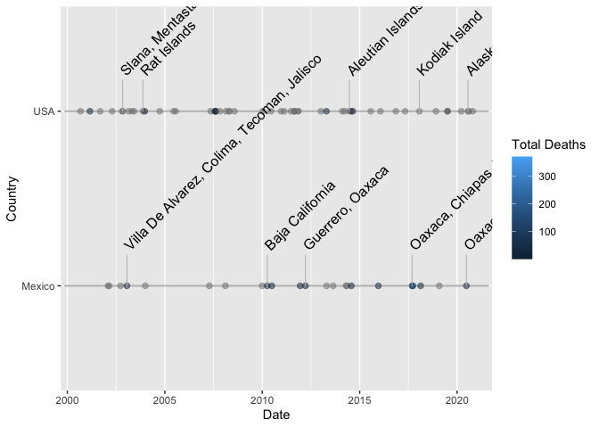

This package is the capstone project for Coursera’s *Mastering Software
Development in R* specialization consisting of the courses

-   [The R Programming
    Environment](https://www.coursera.org/learn/r-programming-environment?specialization=r),
-   [Advanced R
    Programming](https://www.coursera.org/learn/advanced-r?specialization=r),
-   [Building R
    Packages](https://www.coursera.org/learn/r-packages?specialization=r),
-   [Building Data Visualization
    Tools](https://www.coursera.org/learn/r-data-visualization?specialization=r),
-   [Mastering Software Development in R
    Capstone](https://www.coursera.org/learn/r-capstone?specialization=r)

The package provides functions to clean and visualize data from the
[NOAA Significant Earthquake
Database](https://www.ngdc.noaa.gov/hazel/view/hazards/earthquake/search).

### Dataset

The NOAA Significant Earthquake database can be downloaded by visiting
[the
database](https://www.ngdc.noaa.gov/hazel/view/hazards/earthquake/search)
and performing a search. In the top left corner of the result there is
an icon for downloading the results as a tab-separated file.

### Cleaning

Assuming the dataset has been downloaded as `earthquakes.tsv`, the data
can be cleaned using the function `eq_clean_data` which returns a
dataframe that can be subsequentially filtered, etc.

    df <- readr::read_delim("earthquakes.tsv", delim = "\t") %>%
      eq_clean_data() %>%
      dplyr::filter(
        Country %in% c("USA", "Mexico") & lubridate::year(Date) >= 2000
      )

    ## 
    ## ── Column specification ────────────────────────────────────────────────────────
    ## cols(
    ##   .default = col_double(),
    ##   `Search Parameters` = col_character(),
    ##   `Location Name` = col_character(),
    ##   Missing = col_logical(),
    ##   `Damage ($Mil)` = col_logical(),
    ##   `Total Missing` = col_logical(),
    ##   `Total Missing Description` = col_logical(),
    ##   `Total Damage ($Mil)` = col_logical()
    ## )
    ## ℹ Use `spec()` for the full column specifications.

    ## Warning: 994 parsing failures.
    ##  row           col           expected actual              file
    ## 1634 Damage ($Mil) 1/0/T/F/TRUE/FALSE   3    'earthquakes.tsv'
    ## 1653 Damage ($Mil) 1/0/T/F/TRUE/FALSE   0.17 'earthquakes.tsv'
    ## 1665 Missing       1/0/T/F/TRUE/FALSE   30   'earthquakes.tsv'
    ## 1665 Total Missing 1/0/T/F/TRUE/FALSE   30   'earthquakes.tsv'
    ## 1756 Damage ($Mil) 1/0/T/F/TRUE/FALSE   0.8  'earthquakes.tsv'
    ## .... ............. .................. ...... .................
    ## See problems(...) for more details.

Note that the BCE events are removed from the results per the
requirements of using the class `Date` for the dates. This could be
remedied by using the package
[gregorian](https://github.com/edgararuiz/gregorian).

### Timeline

Having cleaned the data, the events can now be plotted on a timeline
with optional label annotation. Below, the timeline is plotted with a
separate axis for each country and events are colored according to the
total number of deaths. The five highest magnitude events are annotated
with their corresponding location.

    df %>%
      ggplot(aes(x = Date, y = Country, colour = `Total Deaths`), alpha = 1) +
      geom_timeline() +
      geom_timeline_label(
        aes(label = `Location Name`, magnitude = Mag),
        n_max = 5
      )

### Map

The sites of the events can also be plotted on an interactive map. The
sites will show a tooltip containing details when clicked. Here, the
helper function `eq_create_label` is used to create the underlying html
for the tooltip.

    df %>%
      dplyr::mutate(popup_text = eq_create_label(.)) %>%
      eq_map(annot_col = "popup_text")

