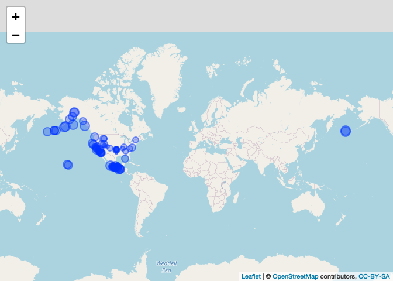

This package is the capstone project for Coursera’s *Mastering Software
Development in R* specialization consisting of the courses

-   [The R Programming
    Environment](https://www.coursera.org/learn/r-programming-environment?specialization=r),
-   [Advanced R
    Programming](https://www.coursera.org/learn/advanced-r?specialization=r),
-   [Building R
    Packages](https://www.coursera.org/learn/r-packages?specialization=r),
-   [Building Data Visualization
    Tools](https://www.coursera.org/learn/r-data-visualization?specialization=r),
-   [Mastering Software Development in R
    Capstone](https://www.coursera.org/learn/r-capstone?specialization=r)

The package provides functions to clean and visualize data from the
[NOAA Significant Earthquake
Database](https://www.ngdc.noaa.gov/hazel/view/hazards/earthquake/search).

### Installation

Install the development version of this package using

    devtools::install_github("lemonad/coursera-mastering-r-capstone")

### Dataset

The NOAA Significant Earthquake database can be made available by
executing the following

    api_uri <- "https://www.ngdc.noaa.gov/hazel/hazard-service/api/v1/earthquakes"
    f <- jsonlite::read_json(api_uri, simplify = TRUE)
    earthquakes <- dplyr::as_tibble(f$items)

### Cleaning

The API data has some quirks and can be made easier to work with by
using the function `eq_clean_data` which returns a dataframe that can be
subsequently filtered, etc.

    df <- earthquakes %>%
      eq_clean_data() %>%
      dplyr::filter(
        country %in% c("USA", "Mexico") & lubridate::year(date) >= 2000
      )

Note that the BCE events are removed from the results per the
requirements of using the class `Date` for the dates. This could be
remedied by using the package
[gregorian](https://github.com/edgararuiz/gregorian).

### Timeline

Having cleaned the data, the events can now be plotted on a timeline
with optional label annotation. Below, the timeline is plotted with a
separate axis for each country and events are colored according to the
total number of deaths. The five highest magnitude events are annotated
with their corresponding location.

    df %>%
      ggplot2::ggplot(
        ggplot2::aes(x = date, y = country, colour = deathsTotal),
        alpha = 
      ) +
      geom_timeline() +
      geom_timeline_label(
        ggplot2::aes(label = locationName, magnitude = eqMagnitude),
        n_max = 5
      )

### Map

The sites of the events can also be plotted on an interactive map. The
sites will show a tooltip containing details when clicked. Here, the
helper function `eq_create_label` is used to create the underlying html
for the tooltip.

    df %>%
      dplyr::mutate(popup_text = eq_create_label(.)) %>%
      eq_map(annot_col = "popup_text")

